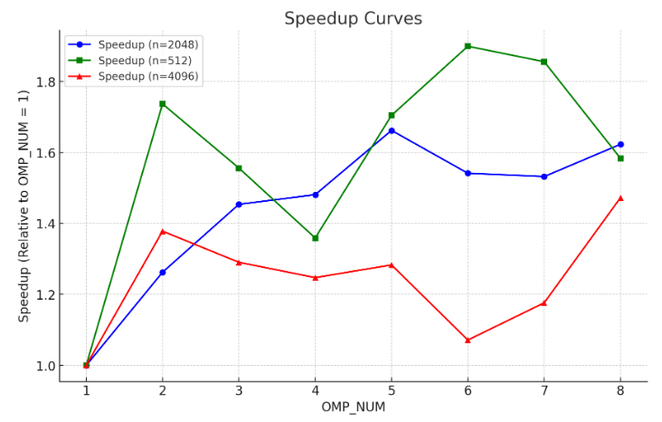

# TD1

`pandoc -s --toc README.md --css=./github-pandoc.css -o README.html`

## lscpu

*lscpu donne des infos utiles sur le processeur : nb core, taille de cache :*

```
Architecture:            x86_64
  CPU op-mode(s):        32-bit, 64-bit
  Address sizes:         39 bits physical, 48 bits virtual
  Byte Order:            Little Endian

CPU(s):                  4
  On-line CPU(s) list:   0-3

Vendor ID:               GenuineIntel
  Model name:            Intel(R) Core(TM) i7-7500U CPU @ 2.70GHz
    CPU family:          6
    Model:               142
    Thread(s) per core:  2
    Core(s) per socket:  2
    Socket(s):           1
    Stepping:            9
    BogoMIPS:            5807.99
   
Caches (sum of all):     
  L1d:                   64 KiB (2 instances)
  L1i:                   64 KiB (2 instances)
  L2:                    512 KiB (2 instances)
  L3:                    4 MiB (1 instance)

`````````````````````````````````````````````


## Produit matrice-matrice

### Effet de la taille de la matrice

  n            | MFlops    | Temps CPU
---------------|-----------|--------
1024 (origine) | 59.0197   | 36.3859 s
1023           | 92.5256   | 23.1417 s
1025           | 90.2636   | 23.861  s
1026           | 96.1386   | 22.4685 s
2047           | 100.759   | 170.256 s
2048           | 73.2614   | 234.501 s
2049           | 102.703   | 167.523 s

*Résultats*
La différence de performance entre les tailles de matrices multiples de 2 et celles qui ne le sont pas peut s'expliquer par la gestion de la mémoire par le CPU et la structure même de la mémoire.

Les architectures modernes de processeurs sont conçues pour stocker et accéder aux données de manière séquentielle. Lorsqu'une variable est utilisée à la position 𝑖, il est fréquent d'accéder ensuite à la position 𝑖 + 1. Ainsi, le CPU optimise ces accès en enregistrant les variables en séquence.

La mémoire est construite à partir de structures binaires et fonctionne avec des tailles multiples de 2. Lorsque la taille de la matrice est une puissance de 2, l’adressage peut entraîner des conflits de cache car certaines données sont mappées aux mêmes emplacements mémoire, ce qui force le CPU à recharger les données plus souvent et entraîne une perte d'efficacité.

Cela explique pourquoi, pour 𝑛 = 1024, la performance est plus faible en raison de ces conflits. En revanche, pour 𝑛 = 1023, 1025, 1026, qui ne sont pas des puissances de 2, l’accès à la mémoire est plus efficace, réduisant les conflits de cache et améliorant l’utilisation des ressources du CPU. Ainsi, les performances en MFlops sont meilleures et le temps d’exécution est réduit.

Pour 𝑛 = 2048, le problème est différent : la taille de la matrice dépasse la capacité du cache L3 du processeur (4 MiB). Comme une matrice 2048 × 2048 en double précision occupe 32 MiB, la majorité des accès mémoire se fait en RAM, qui est beaucoup plus lente que le cache. Cela entraîne une forte augmentation du temps d’exécution et une diminution des MFlops.

En résumé, la performance dépend de l’alignement mémoire et de l’utilisation efficace du cache. Les tailles qui minimisent les conflits de cache et qui restent dans les limites du cache L3 offrent de meilleures performances.

### Permutation des boucles

*Expliquer comment est compilé le code (ligne de make ou de gcc) : on aura besoin de savoir l'optim, les paramètres, etc. Par exemple :*

`make TestProduct.exe && ./TestProduct.exe 1024`


  ordre           | time    | MFlops  | MFlops(n=2048)
------------------|---------|---------|----------------
i,j,k (origine)   | 5.97182 | 359.603 | 165.088
j,i,k             | 9.63033 | 222.992 | 167.944
i,k,j             | 27.8432 | 77.1278 | 66.5025
k,i,j             | 28.4341 | 75.5248 | 66.2263
j,k,i             | 0.99214 | 2164.5  | 2038.18
k,j,i             | 2.50896 | 855.925 | 1150.28


*Résultats.*
On remarque que l'ordre des boucles a un impact significatif sur la performance. L'ordre j,k,i est le plus performant avec 2164.5 MFlops pour n=1024, tandis que k,i,j et i,k,j sont les moins performants avec environ 75-77 MFlops.

La raison principale est la manière dont les données sont stockées et accédées en mémoire. Dans l'architecture mémoire moderne, les données sont stockées en groupe, généralement par lignes. Lorsque l'itération la plus fréquente est effectuée sur i, cela signifie que l'accès mémoire est séquentiel au sein d'une ligne, ce qui améliore la localité spatiale et réduit les accès redondants au cache.

Dans le meilleure code (jki), i représente les lignes et j les colonnes. Lorsque l'itération principale se fait sur i, les accès mémoire suivent un schéma optimisé, limitant les conflits de cache et améliorant les performances globales.


### OMP sur la meilleure boucle

`make TestProductMatrix.exe && OMP_NUM_THREADS=8 ./TestProduct.exe 1024`

  OMP_NUM         | MFlops  | MFlops(n=2048) | MFlops(n=512)  | MFlops(n=4096)
------------------|---------|----------------|----------------|---------------
          1       | 2205.05 |    1718.21     |     1958.75    |  1861.64
          2       | 2147.67 |    2169.58     |     3402.88    |  2566.45
          3       | 3136.89 |    2498.59     |     3048.99    |  2403.1
          4       | 3650.08 |    2545.44     |     2662.67    |  2322.51                                
          5       | 2557.92 |    2856.77     |     3339.79    |  2389.14
          6       | 3470.06 |    2649.2      |     3721.35    |  1994.97
          7       | 2677.08 |    2633.02     |     3635.96    |  2190.33
          8       | 3470.28 |    2789.76     |     3102.2     |  2742.43

*Tracer les courbes de speedup (pour chaque valeur de n), discuter les résultats.*



L'ajout de l'OpenMP améliore les performances en parallèle, mais avec certaines limitations. Lorsque OMP_NUM_THREADS=1, la performance atteint environ 2205.05 MFlops pour n=1024. En augmentant le nombre de threads à 8, la performance augmente à 3470.28 MFlops.

Cependant, on observe qu'après un certain nombre de threads (entre 4 et 6), la performance commence à fluctuer et ne s'améliore plus systématiquement. Cela peut être dû à une surcharge de synchronisation entre les threads, un partage inefficace des ressources du cache entre les threads ou une saturation des unités de calcul du CPU.

Ainsi, bien que l'OpenMP améliore considérablement la performance, il existe une limite au-delà de laquelle l'ajout de threads n'apporte plus de bénéfice.


### Produit par blocs

`make TestProduct.exe && ./TestProduct.exe 1024`

  szBlock         | MFlops  | MFlops(n=2048) | MFlops(n=512)  | MFlops(n=4096)
------------------|---------|----------------|----------------|---------------
origine (=max)    |  
32                | 1562.28 |    980.154     |    3047.65     |   810.341
64                | 1692.82 |    1097.51     |    3527.45     |   909.33
128               | 2752.01 |    1515.26     |    3227.92     |   1189
256               | 1724.25 |    1961.06     |    2508.5      |   1593.53
512               | 2490.69 |    1739.55     |    2167.51     |   2324.04
1024              | 1647.02 |    2098.8      |  erreur numer  |   2362.12

*Résultats.*
Les résultats montrent comment les performances (MFlops) varient en fonction de la taille des blocs (szBlock) et de différentes tailles de données (n).

Petits blocs (szBlock = 32, 64) : Les performances sont faibles, car des blocs trop petits n'exploitent pas bien le cache du processeur.
Blocs moyens (szBlock = 128, 256) : Meilleures performances, surtout avec szBlock = 128, qui optimise l'utilisation du cache et l'accès à la mémoire.
Grands blocs (szBlock = 512, 1024) : Les performances commencent à baisser avec des blocs plus grands, car trop de données peuvent saturer le cache et devenir inefficaces.

Erreur numérique (szBlock = 1024, n = 512) : Cette erreur indique que l'utilisation de blocs trop grands pour des tailles de données plus petites cause des problèmes de calcul.

De cette manière, on peut concluire que les tailles de blocs moyennes (128 à 512) offrent le meilleur compromis entre performance et efficacité. Des blocs trop petits ou trop grands peuvent réduire les performances.


### Bloc + OMP


  szBlock      | OMP_NUM | MFlops  | MFlops(n=2048) | MFlops(n=512)  | MFlops(n=4096)|
---------------|---------|---------|----------------|----------------|---------------|
      1024     |  1      | 1927.51 |    1952.15     |   erreur num   |    1758.14    |
      1024     |  8      | 1668.04 |    2620.97     |   erreur num   |    2403.91    |
      512      |  1      | 1677.29 |    1363.72     |    1598.8      |    1637.81    |
      512      |  8      | 1597.13 |    2736.25     |    1622.84     |    1815.29    |

*Résultats.*
Les résultats montrent que l'utilisation d'OpenMP améliore les performances pour les grandes tailles de matrices, surtout avec 8 threads. Avec szBlock = 1024, l'ajout de threads améliore les performances pour n = 2048 et 4096, mais reste inférieur à la version mono-thread pour n = 1024. Avec szBlock = 512, l'effet du parallélisme est plus marqué, notamment pour n = 2048 où l'on observe une nette augmentation du MFlops.

Cependant, il y a une erreur numérique pour n = 512 avec szBlock = 1024, ce qui suggère que l'utilisation de blocs trop grands avec un nombre réduit de données peut poser des problèmes de précision ou d'alignement mémoire.


### Comparaison avec BLAS, Eigen et numpy

*Comparer les performances avec un calcul similaire utilisant les bibliothèques d'algèbre linéaire BLAS, Eigen et/ou numpy.*

Comparé aux bibliothèques comme BLAS, Eigen et Numpy, l'optimisation de bas niveau de BLAS permet généralement d'obtenir de meilleures performances grâce à des optimisations spécifiques au processeur. Eigen offre un bon compromis en C++ avec des optimisations similaires, tandis que Numpy, bien que plus accessible, peut être moins performant pour des calculs lourds sans l'utilisation de BLAS en arrière-plan.


# Tips

```
	env
	OMP_NUM_THREADS=4 ./produitMatriceMatrice.exe
```

```
    $ for i in $(seq 1 4); do elap=$(OMP_NUM_THREADS=$i ./TestProductOmp.exe|grep "Temps CPU"|cut -d " " -f 7); echo -e "$i\t$elap"; done > timers.out
```
